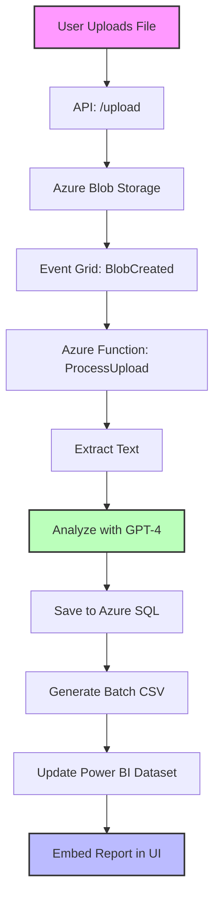

# AnalytiQ 

## AI-Powered Feedback Analytics

> Transform raw customer feedback into actionable insights with our cutting-edge platform

[](https://azure.microsoft.com)
[](https://dotnet.microsoft.com/)
[](https://powerbi.microsoft.com/)
[](https://azure.microsoft.com/services/openai-service/)
[](https://github.com/victorbash400/AnalitiqProject)

AnalytiQ is a comprehensive feedback analytics platform that leverages **Azure AI Services**, **Power BI**, and **.NET technologies** to help businesses process customer feedback, analyze sentiments, and visualize data with unprecedented ease.

## 🚀 Features

<table>
  <tr>
    <td width="50%">
      <h3>🔍 Multi-Format Analysis</h3>
      <p>Process feedback from PDF, DOCX, CSV, TXT, and XLSX files seamlessly.</p>
    </td>
    <td width="50%">
      <h3>🤖 AI-Powered Insights</h3>
      <p>Leverage Azure OpenAI (GPT-4) for advanced sentiment analysis and feedback categorization.</p>
    </td>
  </tr>
  <tr>
    <td>
      <h3>📊 Interactive Dashboards</h3>
      <p>Visualize insights through embedded Power BI reports with tenant-level security.</p>
    </td>
    <td>
      <h3>☁️ Cloud-Native Architecture</h3>
      <p>Built on Azure services for scalability, reliability, and enterprise-grade security.</p>
    </td>
  </tr>
</table>

## 📂 Architecture

AnalytiQ consists of four key components working together:



1. **WPF Desktop UI** - Sleek, modern interface built with VB.NET
2. **ASP.NET Core Web API** - Handles file uploads and authentication
3. **Azure Functions** - AI-powered file processing pipeline
4. **Power BI Embed** - Interactive data visualization with tenant filtering

## 🖥️ User Interface

Our intuitive interface offers seamless navigation between key features:

<div align="center">
  
  <p><i>Dashboard view showing key metrics and insights</i></p>
</div>

<table>
  <tr>
    <td width="50%">
      
      <p align="center"><i>Analytics view</i></p>
    </td>
    <td width="50%">
      
      <p align="center"><i>File upload interface</i></p>
    </td>
  </tr>
  <tr>
    <td>
      
      <p align="center"><i>Settings configuration</i></p>
    </td>
    <td>
      
      <p align="center"><i>Admin control panel</i></p>
    </td>
  </tr>
</table>

## 🛠️ Technology Stack

<table>
  <tr>
    <th>Category</th>
    <th>Technologies</th>
  </tr>
  <tr>
    <td><strong>Frontend</strong></td>
    <td>WPF (.NET 8), WebView2</td>
  </tr>
  <tr>
    <td><strong>Backend</strong></td>
    <td>ASP.NET Core Web API</td>
  </tr>
  <tr>
    <td><strong>Cloud Services</strong></td>
    <td>Azure Functions, Blob Storage, Event Grid, SQL Database</td>
  </tr>
  <tr>
    <td><strong>AI Services</strong></td>
    <td>Azure OpenAI (GPT-4), Document Intelligence</td>
  </tr>
  <tr>
    <td><strong>Data Visualization</strong></td>
    <td>Power BI Embedded</td>
  </tr>
  <tr>
    <td><strong>Libraries</strong></td>
    <td>CsvHelper, ExcelDataReader, Open XML SDK</td>
  </tr>
</table>

## 📊 Power BI Integration

AnalytiQ seamlessly embeds Power BI reports with role-level security to ensure data isolation per tenant:

<div align="center">
  
  <p><i>Interactive Power BI dashboard with feedback insights</i></p>
</div>

## 🤖 AI Processing

The AI pipeline processes feedback using Azure OpenAI and Document Intelligence:

<div align="center">
  <table>
    <tr>
      <td></td>
      <td></td>
    </tr>
    <tr>
      <td></td>
      <td></td>
    </tr>
  </table>
</div>

### Sample GPT-4 Analysis Output

```json
{
  "SentimentScore": 0.7,
  "SentimentCategory": "Positive",
  "UrgencyLevel": "Low",
  "KeyPhrases": "great service, fast delivery",
  "RecommendationText": "Maintain current service levels.",
  "RelatedIssue": "Delivery Speed",
  "ImpactScore": 0.3,
  "CustomerSegmentGuess": "Regular User"
}
```

## 🚀 Getting Started

### Prerequisites

- **.NET 8 SDK**
- **Azure Subscription**
- **Power BI Pro Account**
- **Visual Studio 2022**

### Installation

1. **Clone the Repository**
   ```bash
   git clone https://github.com/victorbash400/AnalitiqProject.git
   cd AnalitiqProject
   ```

2. **API Setup**
   ```bash
   cd API
   dotnet restore
   # Configure appsettings.json with your Azure credentials
   dotnet run
   ```

3. **WPF UI Setup**
   ```bash
   # Open UI/AnalytiQ.sln in Visual Studio
   # Build and run the solution
   ```

4. **Azure Functions Deployment**
   ```bash
   cd ProcessUpload
   func azure functionapp publish analytiq-functions
   ```

5. **Power BI Configuration**
   - Register an Azure AD application
   - Configure Power BI API permissions
   - Update credentials in `PowerBIEmbed/appsettings.json`

## ☁️ Azure Deployment

Deploy the complete solution to Azure with these commands:

```bash
# Resource Group
az group create --name AnalytiQ-Resources --location eastus

# API
az webapp up --name analytiq-api --resource-group AnalytiQ-Resources

# Storage
az storage account create --name analytiqstorage290 --resource-group AnalytiQ-Resources --sku Standard_LRS

# SQL Database
az sql db create --resource-group AnalytiQ-Resources --server analytiq-sql --name AnalytiQDB --service-objective S0

# Function App
az functionapp create --name analytiq-functions --storage-account analytiqstorage290 --consumption-plan-location eastus --resource-group AnalytiQ-Resources --runtime dotnet
```

## 🔮 Future Roadmap

- 📊 **Enhanced Analytics**: More granular Power BI visuals and reports
- 📱 **Mobile App**: Access insights on-the-go with a responsive mobile interface
- 🌐 **Multi-Language Support**: Process feedback in multiple languages
- 🧠 **Custom AI Models**: Train domain-specific models for specialized industries
- 🔄 **Real-Time Processing**: Stream analytics for instant insights

## 🤝 Contributing

We welcome contributions! Here's how to get involved:

1. Fork the repository
2. Create a feature branch: `git checkout -b feature-xyz`
3. Commit your changes: `git commit -m 'Add feature XYZ'`
4. Push to your branch: `git push origin feature-xyz`
5. Open a pull request

## 📜 License

MIT License © 2025 Victor Bash

## 👨‍💻 About the Author

Developed by **Victor Bash** for the **Microsoft Hackathon**. Special thanks to the Azure and Power BI teams for their amazing tools!

---

<div align="center">
  
  <p><b>AnalytiQ</b> — Making sense of customer voices</p>
</div>
