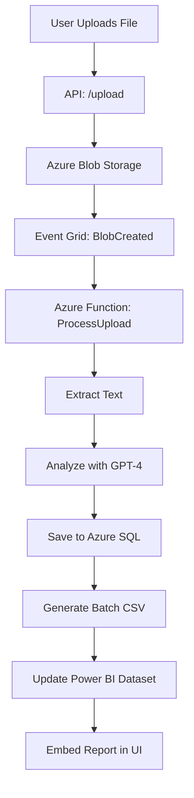

# AnalytiQ - AI-Powered Feedback Analytics


Welcome to **AnalytiQ**, a cutting-edge, AI-driven platform that transforms raw customer feedback into actionable insights! Leveraging **Azure AI Services**, **Power BI**, and **.NET technologies**, AnalytiQ empowers businesses to process feedback, analyze sentiments, and visualize data with ease. This README provides a detailed guide to the project, its components, setup instructions, and more.

---

## 🚀 Overview

AnalytiQ is designed to streamline feedback analysis through a robust, modular architecture. It consists of four key components:

1. **UI** - A sleek, WPF-based desktop application built with VB.NET.
2. **API** - An ASP.NET Core Web API for file uploads and user authentication.
3. **ProcessUpload** - Azure Functions for AI-powered file processing.
4. **Power BI Embed** - Secure integration of Power BI dashboards for data visualization.

**What it does:**
- 📤 Accepts feedback in multiple formats (PDF, DOCX, CSV, TXT, XLSX).
- 🤖 Uses Azure OpenAI (GPT-4) and Document Intelligence to extract and analyze text.
- 📊 Delivers interactive, tenant-filtered insights via Power BI Embedded.

---

## 📂 Repository Structure

Here’s how the project is organized:

```
AnalytiQ/
├── UI/                  # WPF Desktop App (VB.NET)
├── API/                 # ASP.NET Core Web API (C#)
├── ProcessUpload/       # Azure Functions for file processing (C#)
└── PowerBIEmbed/        # Power BI report embedding (C#)
```

Each folder contains a self-contained component with its own dependencies and configuration files.

---

## 🛠️ Technologies Used

AnalytiQ leverages a modern tech stack for scalability and performance:

| **Category**         | **Technologies**                              |
|-----------------------|-----------------------------------------------|
| **Frontend**         | WPF (.NET 8), WebView2                       |
| **Backend**          | ASP.NET Core Web API                         |
| **Cloud Services**   | Azure Functions, Blob Storage, Event Grid, SQL Database |
| **AI Services**      | Azure OpenAI (GPT-4), Cognitive Services (Document Intelligence) |
| **Data Visualization** | Power BI Embedded                          |
| **Libraries**        | CsvHelper, ExcelDataReader, Open XML SDK     |

---

## 🖥️ UI - AnalytiQ WPF App

The **AnalytiQ UI** is a modern desktop application built with **WPF** and **VB.NET**, offering an intuitive interface for feedback management.

### 🔹 Features
- **WebView2 Integration**: Embeds Power BI reports seamlessly.
- **Dynamic Navigation**: Switch between Dashboard, Analytics, Data Upload, Settings, and Admin views.
- **Tenant-Based Authentication**: Ensures data isolation per company.
- **File Upload**: Integrates with Azure Blob Storage for seamless uploads.

### 📜 Main Components
- **`MainWindow.xaml` & `MainWindow.vb`**: Core UI structure and logic.
- **WebView2**: Renders Power BI reports with Role-Level Security (RLS).
- **API Integration**: Communicates with the backend for data retrieval and uploads.

### ⚙️ How It Works
1. **Login**: Users authenticate with a tenant-specific token.
2. **Upload**: Feedback files are sent to the API and stored in Blob Storage.
3. **Analysis**: AI processing is triggered, with results stored in Azure SQL.
4. **Visualization**: Power BI reports display insights in the UI.

### 📸 UI Screenshots


---

## 🌐 API - File Upload & Authentication

The **AnalytiQ API** is an **ASP.NET Core Web API** that handles file uploads, authentication, and event notifications.

### 📌 Key Endpoints
| **Method** | **Endpoint**                  | **Description**                           |
|------------|-------------------------------|-------------------------------------------|
| `POST`     | `/api/FileUpload/upload`      | Uploads files to Azure Blob Storage.      |
| `GET`      | `/api/auth/login`             | Authenticates users and returns a token.  |
| `POST`     | `/api/blobevents/handle-event`| Processes Blob Storage event notifications. |

### ⚙️ How It Works
1. **Upload**: Validates and uploads files, adding metadata like `ProductName`.
2. **Event Trigger**: Uses Event Grid to notify the ProcessUpload Function.
3. **Storage**: Results are persisted in Azure SQL for reporting.

### 📸 API Screenshots
- **[Swagger Docs Placeholder]**: API endpoint documentation.

---

## 🏗️ ProcessUpload - AI-Powered File Processing

The **ProcessUpload Function** is an **Azure Function** that processes uploaded files using AI and stores the results.

### 🚀 Processing Steps
1. **Trigger**: Event Grid detects a new file in Blob Storage.
2. **Text Extraction**: Uses Azure Document Intelligence (PDF), Open XML (DOCX), or libraries for other formats.
3. **Sentiment Analysis**: Azure OpenAI (GPT-4) evaluates feedback.
4. **Storage**: Saves insights to Azure SQL and generates a batch CSV.
5. **Update**: Triggers Power BI dataset refresh.

### 🛠️ Supported File Types
| **File Type** | **Extraction Method**         |
|---------------|-------------------------------|
| PDF           | Azure Document Intelligence   |
| DOCX          | Open XML SDK                  |
| CSV           | CsvHelper                     |
| TXT           | Raw text processing           |
| XLSX          | ExcelDataReader               |

### 📈 GPT-4 Output Example
Here’s a sample JSON output from GPT-4 analysis:

```json
{
  "SentimentScore": 0.7,
  "SentimentCategory": "Positive",
  "UrgencyLevel": "Low",
  "KeyPhrases": "great service, fast delivery",
  "RecommendationText": "Maintain current service levels.",
  "RelatedIssue": "Delivery Speed",
  "ImpactScore": 0.3,
  "CustomerSegmentGuess": "Regular User"
}
```

### 📸 Processing Screenshots


## 📊 Power BI Embedding

The **Power BI Embed Function** securely integrates Power BI reports into the WPF app.

### 🔹 Features
- **Azure AD Security**: Authenticates users via tokens.
- **Tenant Filtering**: Uses RLS to isolate data by tenant.
- **Dynamic Tokens**: Generates embed tokens on-demand.

### 🔑 API Endpoint
| **Method** | **Endpoint**          | **Description**                       |
|------------|-----------------------|---------------------------------------|
| `GET`      | `/api/GetEmbedToken`  | Generates a Power BI embed token.     |

### ⚙️ How It Works
1. **Request**: UI calls the endpoint with `reportId` and `tenantId`.
2. **Token Generation**: Power BI API creates a secure embed token.
3. **Embedding**: Report is rendered in WebView2 with tenant-specific data.

### 📸 Power BI Screenshots


---

## 📈 Data Flow Chart

Here’s how data flows through AnalytiQ:



---

## 🚀 Getting Started

### 🔧 Prerequisites
- **.NET 7 SDK**: For building and running the app.
- **Azure Subscription**: For deploying cloud services.
- **Power BI Pro Account**: For report embedding.
- **Visual Studio 2022**: Recommended for WPF development.

### 🛠️ Installation & Setup

#### 1️⃣ Clone the Repository
```sh
git clone https://github.com/your-repo/AnalytiQ.git
cd AnalytiQ
```

#### 2️⃣ Set Up the API
```sh
cd API
dotnet restore
dotnet run
```
- Configure `appsettings.json` with Azure credentials.

#### 3️⃣ Run the WPF UI
- Open `UI/AnalytiQ.sln` in Visual Studio.
- Build and run the solution.

#### 4️⃣ Deploy Azure Functions
```sh
cd ProcessUpload
func azure functionapp publish analytiq-functions
```
- Set environment variables (e.g., `OPENAI_API_KEY`, `SQL_CONNECTION_STRING`).

#### 5️⃣ Configure Power BI Embedding
- Register an Azure AD app.
- Enable Power BI API permissions.
- Update `PowerBIEmbed` with credentials in `appsettings.json`.

---

## 🌍 Deployment to Azure

### ☁️ Azure Services
| **Service**         | **Purpose**                           |
|---------------------|---------------------------------------|
| Azure Blob Storage  | Stores uploaded files and batch CSVs  |
| Azure SQL Database  | Persists AI-analyzed insights         |
| Azure Functions     | Processes files and triggers updates  |
| Power BI Embedded   | Displays interactive dashboards       |
| Event Grid          | Triggers processing on file upload    |

### 🔥 Deployment Commands
```sh
# Deploy API
az webapp up --name analytiq-api --resource-group AnalytiQ-Resources

# Create Storage Account
az storage account create --name analytiqstorage290 --resource-group AnalytiQ-Resources --sku Standard_LRS

# Create SQL Database
az sql db create --resource-group AnalytiQ-Resources --server analytiq-sql --name AnalytiQDB --service-objective S0
```

---

## 🔥 Future Improvements

- 🌟 **Real-Time Analytics**: Add streaming for instant insights.
- 📊 **Enhanced Reports**: Include more granular Power BI visuals.
- 🤖 **Custom AI Models**: Train models for industry-specific feedback.
- 🏆 **Enterprise Scaling**: Optimize for high-volume usage.

---

## 💡 Contributing

We welcome contributions! Here’s how to get involved:

1. Fork the repository.
2. Create a feature branch: `git checkout -b feature-xyz`.
3. Commit your changes: `git commit -m 'Add feature XYZ'`.
4. Push to your branch: `git push origin feature-xyz`.
5. Submit a pull request! 🚀

---

## 📜 License

MIT License © 2025 Victor Bash

---

## 🤝 Credits

Developed by **Victor Bash** for the **Microsoft  Hackathon**. Special thanks to the Azure and Power BI teams for their amazing tools!

---

## 🚀 Happy Coding!
