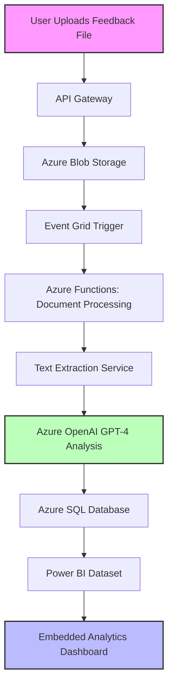

<div align="center">
  
#  **AnalytiQ**

### *Transform the Voice of Your Customers into Your Competitive Edge*

[](https://azure.microsoft.com)
[](https://azure.microsoft.com/services/openai-service/)
[](https://dotnet.microsoft.com/)
[](https://powerbi.microsoft.com/)

**Microsoft Hackathon 2025 Entry** | [Download Now](#-quick-start) | [GitHub Repo](https://github.com/victorbash400/AnalitiqProject)

</div>

---

<div align="center">
  
</div>

## 🚀 **Overview**

**AnalytiQ** is an AI-powered feedback analytics platform that transforms unstructured customer feedback into actionable business intelligence. Built on Azure's cloud infrastructure and leveraging GPT-4's advanced language capabilities, AnalytiQ helps organizations understand customer sentiment, identify emerging trends, and make data-driven decisions with unprecedented efficiency.

<table>
  <tr>
    <td width="33%" align="center">
      <h3>🔍</h3>
      <h3>Analyze Any Format</h3>
      <p>Process customer feedback from PDF, DOCX, CSV, TXT, and XLSX with a simple drag & drop.</p>
    </td>
    <td width="33%" align="center">
      <h3>🤖</h3>
      <h3>AI-Driven Insights</h3>
      <p>Leverage GPT-4 to extract sentiment, categories, and actionable recommendations automatically.</p>
    </td>
    <td width="33%" align="center">
      <h3>📊</h3>
      <h3>Visual Intelligence</h3>
      <p>Explore interactive Power BI dashboards with drill-down capabilities for deeper analysis.</p>
    </td>
  </tr>
</table>

---

## ✨ **Key Features**

### 🧠 **Intelligent Analysis**
- **Multi-dimensional sentiment analysis** beyond positive/negative
- **Automatic categorization** of feedback into product areas, feature requests, and issue types
- **Trend identification** across time periods and customer segments
- **Prioritization engine** that highlights critical issues needing immediate attention

### 🔄 **Seamless Integration**
- **Universal file format support** for all major document and data formats
- **API-first architecture** for integration with existing CRM and support systems
- **Batch processing** for historical data analysis
- **Real-time webhooks** for immediate notification of critical feedback

### 🛡️ **Enterprise Ready**
- **Azure AD integration** with role-based access control
- **End-to-end encryption** of all customer data
- **Compliance-friendly** audit logging and data governance
- **Multi-tenant architecture** with complete data isolation

---

<div align="center">
  
  <p><i>AnalytiQ's integrated Power BI dashboard showing sentiment trends and key metrics</i></p>
</div>

---

## 🔧 **System Architecture**

AnalytiQ leverages Azure's serverless architecture to deliver a scalable, resilient platform for processing customer feedback at any volume.



### **Tech Stack Highlights:**
- **Frontend**: Blazor WebAssembly with responsive design
- **Backend**: .NET 8 Web API with Azure Functions
- **AI Processing**: Azure OpenAI Service (GPT-4)
- **Storage**: Azure Blob Storage + Azure SQL
- **Analytics**: Power BI Embedded with DirectQuery
- **Security**: Azure AD B2C with custom policies

---

## 🖥️ **User Interface**

<table>
  <tr>
    <td width="50%">
      
      <p align="center"><i>Advanced Analytics View with drill-down capabilities</i></p>
    </td>
    <td width="50%">
      
      <p align="center"><i>Intuitive file upload interface with batch processing</i></p>
    </td>
  </tr>
</table>

---

## 🚀 **Quick Start**

### **📥 Download Options**

<table>
  <tr>
    <td width="70%">
      <h3>🚀 AnalytiQ v0.1.0-hackathon</h3>
      <p>Ready-to-run executable with sample data and pre-configured dashboards.</p>
      <a href="https://github.com/victorbash400/AnalitiqProject/releases/download/v0.1.0-hackathon/AnalitiQ.exe.zip"><b>⬇️ DOWNLOAD (12.4 MB)</b></a>
    </td>
    <td width="30%" align="center">
      <h3>📂</h3>
      <a href="https://github.com/victorbash400/AnalitiqProject/releases">View All Releases</a>
    </td>
  </tr>
</table>

### **⚡ One-Minute Setup**

```bash
# 1. Unzip the downloaded file
$ unzip AnalitiQ.exe.zip

# 2. Run the application
$ ./AnalytiQ.exe

# 3. Upload your feedback data and start analyzing!
```

### **🔐 Demo Credentials**
- **Username**: `bob@acmecorp.com`
- **Password**: `Pass123`

---

## 🌐 **Deployment Guide**

### **Prerequisites**
- Azure subscription
- .NET 8 SDK
- Power BI Pro/Premium account
- Azure CLI (for automated deployment)

### **Azure Deployment Script**

```bash
# Setup script for rapid Azure deployment

# 1. Create resource group
az group create --name AnalytiQ-RG --location eastus

# 2. Deploy core infrastructure
az deployment group create \
  --resource-group AnalytiQ-RG \
  --template-file deploy/azuredeploy.json \
  --parameters @deploy/parameters.json

# 3. Configure OpenAI service
az cognitiveservices account deployment create \
  --name analytiq-openai \
  --resource-group AnalytiQ-RG \
  --deployment-name gpt4 \
  --model-format OpenAI \
  --model-name gpt-4 \
  --sku-capacity 1 \
  --sku-name Standard

# 4. Deploy application
az webapp up \
  --name analytiq-app \
  --resource-group AnalytiQ-RG \
  --plan analytiq-plan \
  --sku P1V2
```

Full deployment documentation available in the [Deployment Guide](https://github.com/victorbash400/AnalitiqProject/wiki/Deployment).

---

## 🔮 **Roadmap**

<table>
  <tr>
    <td width="25%" align="center">
      <h3>Q2 2025</h3>
      <ul>
        <li>Real-time analysis</li>
        <li>Custom AI model training</li>
        <li>Advanced filtering</li>
      </ul>
    </td>
    <td width="25%" align="center">
      <h3>Q3 2025</h3>
      <ul>
        <li>Multi-language support</li>
        <li>Competitor analysis</li>
        <li>Mobile app release</li>
      </ul>
    </td>
    <td width="25%" align="center">
      <h3>Q4 2025</h3>
      <ul>
        <li>AI chatbot integration</li>
        <li>Predictive analytics</li>
        <li>Voice feedback analysis</li>
      </ul>
    </td>
    <td width="25%" align="center">
      <h3>Q1 2026</h3>
      <ul>
        <li>Enterprise SSO</li>
        <li>Executive summary generation</li>
        <li>Custom report builder</li>
      </ul>
    </td>
  </tr>
</table>

---

## 🤝 **Contributing**

We welcome contributions from the community! Whether it's adding new features, fixing bugs, or improving documentation, your help makes AnalytiQ better for everyone.

### **Getting Started**

```bash
# Clone the repository
git clone https://github.com/victorbash400/AnalitiqProject.git

# Install dependencies
cd AnalitiqProject
dotnet restore

# Create a new branch
git checkout -b feature/your-amazing-feature

# Make your changes, commit them, and push
git commit -m "Add an amazing feature"
git push origin feature/your-amazing-feature

# Create a pull request
# Visit https://github.com/victorbash400/AnalitiqProject/pulls
```

See our [Contribution Guidelines](https://github.com/victorbash400/AnalitiqProject/wiki/Contributing) for more details.

---

## 📜 **License**

```
MIT License

Copyright (c) 2025 Victor Bash

Permission is hereby granted, free of charge, to any person obtaining a copy
of this software and associated documentation files (the "Software"), to deal
in the Software without restriction, including without limitation the rights
to use, copy, modify, merge, publish, distribute, sublicense, and/or sell
copies of the Software, and to permit persons to whom the Software is
furnished to do so, subject to the following conditions:

The above copyright notice and this permission notice shall be included in all
copies or substantial portions of the Software.

THE SOFTWARE IS PROVIDED "AS IS", WITHOUT WARRANTY OF ANY KIND, EXPRESS OR
IMPLIED, INCLUDING BUT NOT LIMITED TO THE WARRANTIES OF MERCHANTABILITY,
FITNESS FOR A PARTICULAR PURPOSE AND NONINFRINGEMENT. IN NO EVENT SHALL THE
AUTHORS OR COPYRIGHT HOLDERS BE LIABLE FOR ANY CLAIM, DAMAGES OR OTHER
LIABILITY, WHETHER IN AN ACTION OF CONTRACT, TORT OR OTHERWISE, ARISING FROM,
OUT OF OR IN CONNECTION WITH THE SOFTWARE OR THE USE OR OTHER DEALINGS IN THE
SOFTWARE.
```

---

<div align="center">
  
  <h3>AnalytiQ — Where Customer Feedback Meets Intelligence</h3>
  <p>Developed by <b>Victor Bash</b> for the <b>Microsoft Hackathon 2025</b></p>
  <a href="https://github.com/victorbash400/AnalitiqProject/releases/download/v0.1.1-hackathon/AnalytiQ.UI.zip"><b>⬇️ DOWNLOAD NOW ⬇️</b></a>
</div>
