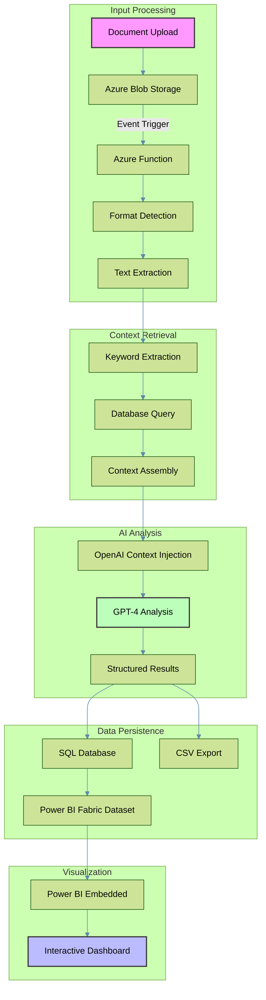

<div align="center">
  
#  **AnalytiQ Saffron**

### *Enterprise-Grade Context-Enhanced AI with Power BI Fabric Integration*

[](https://azure.microsoft.com)
[](https://azure.microsoft.com/services/openai-service/)
[](https://dotnet.microsoft.com/)
[](https://powerbi.microsoft.com/)
[](https://github.com/victorbash400/AnalitiqProject/releases)

**Microsoft Hackathon 2025 Entry** | [Download Saffron](https://github.com/victorbash400/AnalitiqProject/releases/download/AnalytiQ-Saffron/AnalytiQ-Saffron.zip) | [GitHub Repo](https://github.com/victorbash400/AnalitiqProject)

</div>

---

<div align="center">
  
  <p><i>Introducing the Saffron Edition - Advanced Context-Enhanced AI with Power BI Fabric Integration</i></p>
</div>

## 🧠 **Technical Overview**

**AnalytiQ Saffron** represents a major evolution in our enterprise context-enhanced AI architecture, optimized for processing customer feedback at scale with deep contextual analysis powered by Azure OpenAI and .NET 8.

### Core Technical Components

- **Event-Driven Processing** - Serverless architecture triggered by blob storage events
- **Multi-Format Document Processing** - PDF, DOCX, TXT, CSV, XLSX support with specialized extraction techniques
- **Context-Aware AI Implementation** - Dynamic context retrieval from SQL database based on semantic similarity
- **Enhanced Azure OpenAI Integration** - Custom system prompts with retrieved context
- **Power BI Fabric Integration** - Role-based security with real-time tenant filtering

---

## 🔄 **Context-Enhanced Architecture Deep Dive**

### Document Processing Pipeline

Our implementation processes feedback documents through a sophisticated pipeline:


```mermaid
%%{init: {'theme': 'forest', 'themeVariables': { 'primaryColor': '#5D8AA8', 'primaryTextColor': '#fff', 'primaryBorderColor': '#5D8AA8', 'lineColor': '#5D8AA8', 'secondaryColor': '#006400', 'tertiaryColor': '#FFD700' }}}%%
graph TD
    subgraph "Input Processing" 
        A[Document Upload] --> B[Azure Blob Storage]
        B -- Event Trigger --> C[Azure Function]
        C --> D[Format Detection]
        D --> E[Text Extraction]
    end
    
    subgraph "Context Retrieval"
        E --> F[Keyword Extraction]
        F --> G[Database Query]
        G --> H[Context Assembly]
    end
    
    subgraph "AI Analysis"
        H --> I[OpenAI Context Injection]
        I --> J[GPT-4 Analysis]
        J --> K[Structured Results]
    end
    
    subgraph "Data Persistence"
        K --> L[SQL Database]
        K --> M[CSV Export]
        L --> N[Power BI Fabric Dataset]
    end
    
    subgraph "Visualization"
        N --> O[Power BI Embedded]
        O --> P[Interactive Dashboard]
    end
    
    style A fill:#f9f,stroke:#333,stroke-width:2px
    style J fill:#bfb,stroke:#333,stroke-width:2px
    style P fill:#bbf,stroke:#333,stroke-width:2px
```

### Understanding Our Context-Enhanced Architecture vs. True RAG

While our system shares similarities with RAG (Retrieval-Augmented Generation), it's important to note some key differences:

1. **Pre-processed Data** - Unlike traditional RAG that retrieves from unstructured document sources, our system primarily works with already processed data in SQL databases.

2. **Power BI Integration** - Our architecture is optimized for visualization through Power BI Fabric, leveraging processed insights rather than performing real-time retrievals.

3. **Context Enhancement** - We use historical data to provide context for new documents, creating a feedback loop that improves analysis over time.

For these reasons, we describe our system as "Context-Enhanced AI" rather than true RAG, though it incorporates RAG principles in its approach to context retrieval.

### Event-Driven Processing

Our architecture leverages Azure Event Grid to trigger processing when new documents are uploaded:

```csharp
[Function("ProcessUploadedFile")]
public async Task Run([EventGridTrigger] EventGridEvent eventGridEvent)
{
    // Check if this is a blob creation event
    if (eventGridEvent.EventType == "Microsoft.Storage.BlobCreated")
    {
        // Extract blob URL from event data
        string blobUrl = extractBlobUrl(eventGridEvent.Data);
        
        // Process the blob through our pipeline
        await ProcessDocument(blobUrl);
    }
}
```

### Multi-Format Document Processing

Saffron supports various document formats through specialized extractors:

```csharp
string extractedText = fileExtension switch
{
    ".pdf" => await ExtractTextFromPDF(fileBytes),
    ".docx" => await ExtractTextFromDOCX(fileBytes),
    ".txt" => Encoding.UTF8.GetString(fileBytes),
    ".csv" => await ExtractTextFromCSV(fileBytes),
    ".xlsx" => await ExtractTextFromExcel(fileBytes),
    _ => "⚠️ Unsupported file format."
};
```

### Context Retrieval for Enhanced Prompting

A key strength of our implementation is intelligent context retrieval from past feedback:

```csharp
private async Task<string> RetrieveContextFromDatabase(string tenantId, string productName, string extractedText)
{
    // Extract key concepts from user text
    var keywords = ExtractKeywords(extractedText);
    
    // Build SQL query to find similar past feedback
    string query = @"
        SELECT TOP 5 OriginalText, SentimentCategory, RelatedIssue, ProductName
        FROM dbo.ProcessedData
        WHERE TenantID = @TenantID
        AND (ProductName = @ProductName OR @ProductName IS NULL)
        AND (OriginalText LIKE '%' + @Keyword1 + '%' OR
             OriginalText LIKE '%' + @Keyword2 + '%' OR
             OriginalText LIKE '%' + @Keyword3 + '%')
        ORDER BY ProcessingTime DESC";
    
    // Execute query with parameters
    using var connection = new SqlConnection(_connectionString);
    using var command = new SqlCommand(query, connection);
    command.Parameters.AddWithValue("@TenantID", tenantId);
    command.Parameters.AddWithValue("@ProductName", productName ?? (object)DBNull.Value);
    command.Parameters.AddWithValue("@Keyword1", keywords.Count > 0 ? keywords[0] : "");
    command.Parameters.AddWithValue("@Keyword2", keywords.Count > 1 ? keywords[1] : "");
    command.Parameters.AddWithValue("@Keyword3", keywords.Count > 2 ? keywords[2] : "");
    
    await connection.OpenAsync();
    using var reader = await command.ExecuteReaderAsync();
    
    // Build context string from retrieved records
    var context = new StringBuilder();
    while (await reader.ReadAsync())
    {
        context.AppendLine($"- Past Feedback: {reader["OriginalText"]}");
        context.AppendLine($"  Sentiment: {reader["SentimentCategory"]}, Issue: {reader["RelatedIssue"]}");
    }
    
    return context.ToString();
}
```

### Context-Enhanced AI Analysis

Our system injects retrieved context into OpenAI prompts for enhanced analysis:

```csharp
private async Task<AnalyzedTextResult> AnalyzeTextWithGPT4(string text, string contextData)
{
    // Create system prompt with contextual information
    var systemMessage = $@"You are an expert analyst processing customer feedback. 
    Ground your analysis in this prior context from similar feedback:
    
    {contextData}
    
    For each input text, analyze it and return a JSON object with:
        - SentimentScore (float, -1 to 1)
        - SentimentCategory (string)
        - UrgencyLevel (int, 1-5)
        - KeyPhrases (array of strings)
        - RelatedIssue (string)
        - ImpactScore (int, 1-10)";

    // Send to OpenAI API
    var messages = new[] {
        new { role = "system", content = systemMessage },
        new { role = "user", content = $"Analyze this text: '{text}'" }
    };
    
    // Make API call and parse response
    var response = await _openAIClient.SendRequestAsync(messages);
    return JsonSerializer.Deserialize<AnalyzedTextResult>(response);
}
```

---

## 📊 **Power BI Fabric Integration**

<div align="center">
  
  <p><i>Enterprise-grade analytics dashboard with Power BI Fabric and row-level security</i></p>
</div>

### Tenant-Specific Analysis

Our Power BI Fabric integration extends contextual analysis principles through:

1. **DirectQuery connection** to the SQL database for real-time insights
2. **Row-level security** ensuring tenants only see their own data
3. **Dynamic filtering** based on user context
4. **Embedded token generation** for secure dashboard integration
5. **Fabric workspace integration** for enhanced collaboration and sharing

```javascript
// Client-side Power BI embedding
async function embedReport(reportId, tenantId) {
    // Get embed token from our API
    const response = await fetch(`/api/GetEmbedToken?reportId=${reportId}&tenantId=${tenantId}&useRls=true`);
    const { embedUrl, embedToken } = await response.json();
    
    // Configure Power BI report
    const config = {
        type: 'report',
        tokenType: models.TokenType.Embed,
        accessToken: embedToken,
        embedUrl: embedUrl,
        permissions: models.Permissions.Read,
        settings: {
            filterPaneEnabled: false,
            navContentPaneEnabled: true
        }
    };
    
    // Embed the report
    const reportContainer = document.getElementById('reportContainer');
    const report = powerbi.embed(reportContainer, config);
    
    // Handle report events
    report.on('loaded', function() {
        console.log('Report loaded');
    });
}
```

### Fabric Workspace Integration

Saffron leverages Power BI Fabric workspaces for enhanced collaboration:

```powershell
# PowerShell script for Fabric workspace setup
Connect-PowerBIServiceAccount

# Create new Fabric workspace
$workspace = New-PowerBIWorkspace -Name "AnalytiQ Saffron Analytics"

# Configure workspace capacity for Fabric
Set-PowerBIWorkspace -Id $workspace.Id -CapacityId $fabricCapacityId

# Set workspace permissions
Add-PowerBIWorkspaceUser -Id $workspace.Id -UserEmailAddress "team@contoso.com" -AccessRight Admin

# Upload Power BI report template
New-PowerBIReport -Path ".\templates\SaffronAnalytics.pbix" -Name "Customer Feedback Analysis" -WorkspaceId $workspace.Id
```

---

## 🔧 **System Architecture**

### Core Components

- **Azure Functions** - Serverless processing triggered by blob uploads
- **Azure Storage** - Blob storage for document management
- **Azure OpenAI** - GPT-4 analysis with context-aware prompting
- **Azure SQL** - Storage and retrieval of processed feedback
- **Document AI** - Advanced document parsing and text extraction
- **Power BI Fabric** - Interactive visualization with row-level security and collaboration

### Processing Flow

1. **Document Upload** - Files uploaded to Azure Blob Storage
2. **Event Trigger** - Azure Function triggered by blob creation
3. **Text Extraction** - Document-specific extractors pull text content
4. **Context Retrieval** - Similar past feedback retrieved from database
5. **Enhanced AI Analysis** - Context injected into OpenAI prompts
6. **Result Storage** - Analysis results stored in SQL for future retrieval
7. **Visualization** - Power BI Fabric dashboards display insights with RLS

---

## 📊 **Advanced Visualization with Power BI Fabric**

Saffron takes full advantage of Power BI Fabric capabilities:

- **Direct Lake mode** for optimized data access
- **DataMarts** for self-service data preparation
- **Semantic models** with enhanced metadata
- **Data pipeline integration** for continuous updates
- **OneLake integration** for unified data storage

Our architecture connects seamlessly with the broader Fabric ecosystem:

```csharp
private async Task ConfigureFabricDataPipeline(string workspaceId, string datasetId)
{
    // Configure pipeline refresh schedule
    var refreshSchedule = new RefreshSchedule
    {
        Days = new[] { "Monday", "Wednesday", "Friday" },
        Times = new[] { "08:00", "16:00" },
        LocalTimeZoneId = "Eastern Standard Time"
    };
    
    // Set up Fabric data pipeline
    await _powerBIClient.Datasets.SetRefreshScheduleAsync(
        Guid.Parse(workspaceId),
        Guid.Parse(datasetId),
        refreshSchedule
    );
    
    // Configure OneLake connection if available
    if (_fabricSettings.EnableOneLake)
    {
        await ConfigureOneLakeIntegration(workspaceId, datasetId);
    }
}
```

---

## 🚀 **Quick Start**

### **📥 Download Options**

<table>
  <tr>
    <td width="70%">
      <h3>🔥 AnalytiQ v0.3.0-Saffron</h3>
      <p>Our latest release with advanced context-enhanced architecture and Power BI Fabric integration.</p>
      <a href="https://github.com/victorbash400/AnalitiqProject/releases/download/AnalytiQ-Saffron/AnalytiQ-Saffron.zip"><b>⬇️ DOWNLOAD SAFFRON (84.9 MB)</b></a>
    </td>
    <td width="30%" align="center">
      <h3>📂</h3>
      <a href="https://github.com/victorbash400/AnalitiqProject/releases">View All Releases</a>
    </td>
  </tr>
</table>

### **⚡ Quick Setup**

```bash
# 1. Unzip the downloaded file
$ unzip AnalytiQ-Saffron.zip

# 2. Configure Azure resources
$ cd AnalytiQ-Saffron
$ dotnet run setup

# 3. Start the application
$ dotnet run start
```

### **🚀 Azure Deployment**

```bash
# Deploy core infrastructure
az deployment group create \
  --resource-group AnalytiQ-RG \
  --template-file deploy/azuredeploy.json \
  --parameters @deploy/parameters.json

# Configure OpenAI service
az cognitiveservices account deployment create \
  --name analytiq-openai \
  --resource-group AnalytiQ-RG \
  --deployment-name gpt4 \
  --model-format OpenAI \
  --model-name gpt-4 \
  --sku-capacity 1
```

---

## 📋 **Implementation Details**

### Context Creation and Assembly

The core of our context-enhanced implementation is in context assembly:

```csharp
private string AssembleContext(IEnumerable<FeedbackRecord> records)
{
    var contextBuilder = new StringBuilder();
    
    // Add historical context for sentiment patterns
    contextBuilder.AppendLine("# Historical Context");
    foreach (var record in records)
    {
        contextBuilder.AppendLine($"- {record.ProductName}: \"{record.Text.Substring(0, Math.Min(100, record.Text.Length))}...\"");
        contextBuilder.AppendLine($"  - Sentiment: {record.SentimentCategory} ({record.SentimentScore:F2})");
        contextBuilder.AppendLine($"  - Issues: {record.RelatedIssue}");
        contextBuilder.AppendLine($"  - Impact: {record.ImpactScore}/10");
    }
    
    // Add statistical context
    var avgSentiment = records.Average(r => r.SentimentScore);
    var mostCommonIssue = records
        .GroupBy(r => r.RelatedIssue)
        .OrderByDescending(g => g.Count())
        .FirstOrDefault()?.Key;
    
    contextBuilder.AppendLine("\n# Statistical Summary");
    contextBuilder.AppendLine($"- Average Sentiment: {avgSentiment:F2}");
    contextBuilder.AppendLine($"- Most Common Issue: {mostCommonIssue ?? "N/A"}");
    
    return contextBuilder.ToString();
}
```

### Enhanced File Upload UI

<div align="center">
  
  <p><i>Saffron's enhanced file upload interface with real-time processing visualization</i></p>
</div>

### Power BI Fabric Integration Details

Saffron leverages the Power BI Fabric ecosystem for enhanced analytics:

```csharp
public class FabricIntegration
{
    private readonly PowerBIClient _powerBIClient;
    private readonly FabricSettings _fabricSettings;
    
    public FabricIntegration(PowerBIClient powerBIClient, FabricSettings fabricSettings)
    {
        _powerBIClient = powerBIClient;
        _fabricSettings = fabricSettings;
    }
    
    public async Task<WorkspaceInfo> CreateFabricWorkspace(string name, string description)
    {
        // Create Power BI Fabric workspace
        var workspace = await _powerBIClient.Workspaces.PostWorkspaceAsync(
            new CreateWorkspaceRequest
            {
                Name = name,
                Description = description,
                Type = "Workspace"
            });
        
        // Configure Fabric-specific settings
        await _powerBIClient.Workspaces.UpdateWorkspaceAsync(
            workspace.Id,
            new UpdateWorkspaceRequest
            {
                // Enable Fabric features
                CapacityId = _fabricSettings.CapacityId,
                DefaultDatasetStorageFormat = "DirectLake"
            });
        
        return workspace;
    }
    
    public async Task ConfigureDataset(Guid workspaceId, Guid datasetId)
    {
        // Configure refresh schedule
        await _powerBIClient.Datasets.SetRefreshScheduleAsync(
            workspaceId,
            datasetId,
            new RefreshSchedule
            {
                Days = new[] { "Monday", "Wednesday", "Friday" },
                Times = new[] { "08:00", "16:00" },
                Enabled = true
            });
        
        // Configure dataset parameters for tenant filtering
        await _powerBIClient.Datasets.UpdateParametersInGroupAsync(
            workspaceId,
            datasetId,
            new UpdateParametersRequest
            {
                UpdateDetails = new List<UpdateParameterDetails>
                {
                    new UpdateParameterDetails
                    {
                        Name = "TenantFilter",
                        NewValue = "All"
                    }
                }
            });
    }
}
```

### Deployment Script

Our repository includes complete deployment scripts:

```bash
#!/bin/bash
# deploy.sh - Automated deployment script for AnalytiQ Saffron

# 1. Create Azure resources
echo "Creating Azure resources..."
az group create --name $RESOURCE_GROUP --location $LOCATION

# 2. Deploy infrastructure
echo "Deploying infrastructure..."
az deployment group create \
  --resource-group $RESOURCE_GROUP \
  --template-file infrastructure/azuredeploy.json \
  --parameters @infrastructure/parameters.json

# 3. Deploy Azure Functions
echo "Deploying Azure Functions..."
cd src/AnalytiQ.Functions
func azure functionapp publish $FUNCTION_APP_NAME --dotnet

# 4. Configure OpenAI service
echo "Configuring OpenAI service..."
az cognitiveservices account deployment create \
  --name $OPENAI_SERVICE_NAME \
  --resource-group $RESOURCE_GROUP \
  --deployment-name gpt4 \
  --model-format OpenAI \
  --model-name gpt-4 \
  --sku-capacity 1 \
  --sku-name Standard

# 5. Set up Power BI Fabric workspace
echo "Setting up Power BI Fabric workspace..."
cd ../AnalytiQ.PowerBI
pwsh ./setup-powerbi.ps1 -WorkspaceName $WORKSPACE_NAME
```

---

## 📜 **License**

```
MIT License

Copyright (c) 2025 Victor Bash

Permission is hereby granted, free of charge, to any person obtaining a copy
of this software and associated documentation files (the "Software"), to deal
in the Software without restriction, including without limitation the rights
to use, copy, modify, merge, publish, distribute, sublicense, and/or sell
copies of the Software, and to permit persons to whom the Software is
furnished to do so, subject to the following conditions:

The above copyright notice and this permission notice shall be included in all
copies or substantial portions of the Software.

THE SOFTWARE IS PROVIDED "AS IS", WITHOUT WARRANTY OF ANY KIND, EXPRESS OR
IMPLIED, INCLUDING BUT NOT LIMITED TO THE WARRANTIES OF MERCHANTABILITY,
FITNESS FOR A PARTICULAR PURPOSE AND NONINFRINGEMENT. IN NO EVENT SHALL THE
AUTHORS OR COPYRIGHT HOLDERS BE LIABLE FOR ANY CLAIM, DAMAGES OR OTHER
LIABILITY, WHETHER IN AN ACTION OF CONTRACT, TORT OR OTHERWISE, ARISING FROM,
OUT OF OR IN CONNECTION WITH THE SOFTWARE OR THE USE OR OTHER DEALINGS IN THE
SOFTWARE.
```

---

<div align="center">
  
  <h3>AnalytiQ Saffron — Enterprise-Grade Context-Enhanced AI with Power BI Fabric</h3>
  <p>Developed by <b>Victor Bash</b> for the <b>Microsoft Hackathon 2025</b></p>
  <a href="https://github.com/victorbash400/AnalitiqProject/releases/download/AnalytiQ-Saffron/AnalytiQ-Saffron.zip"><b>⬇️ DOWNLOAD SAFFRON NOW ⬇️</b></a>
</div>
