# **AnalytiQ**   

## **AI-Powered Feedback Analytics**  

> **Transform raw customer feedback into actionable insights** with our AI-driven platform, built for the Microsoft Hackathon.  

[](https://azure.microsoft.com)  
[](https://dotnet.microsoft.com/)  
[](https://powerbi.microsoft.com/)  
[](https://azure.microsoft.com/services/openai-service/)  
[](https://github.com/victorbash400/AnalitiqProject)  

---

## ⬇️ **Download AnalytiQ Now!**  

🔹 **[🚀 Download v0.1.0-hackathon (ZIP)](https://github.com/victorbash400/AnalitiqProject/releases/download/v0.1.0-hackathon/AnalitiQ.exe.zip)**  
📌 *(Recommended: Grab this if you just want to use AnalytiQ right away!)*  

🔹 **[📂 Check GitHub Releases](https://github.com/victorbash400/AnalitiqProject/releases)**  
📌 *(For past versions & changelogs)*  

---

## **🚀 Features**  

<table>
  <tr>
    <td width="50%">
      <h3>🔍 Multi-Format Analysis</h3>
      <p>Process feedback from PDF, DOCX, CSV, TXT, and XLSX files seamlessly.</p>
    </td>
    <td width="50%">
      <h3>🤖 AI-Powered Insights</h3>
      <p>Leverage Azure OpenAI (GPT-4) for advanced sentiment analysis and feedback categorization.</p>
    </td>
  </tr>
  <tr>
    <td>
      <h3>📊 Interactive Dashboards</h3>
      <p>Visualize insights through embedded Power BI reports with tenant-level security.</p>
    </td>
    <td>
      <h3>☁️ Cloud-Native Architecture</h3>
      <p>Built on Azure services for scalability, reliability, and enterprise-grade security.</p>
    </td>
  </tr>
</table>

---

## **📂 System Architecture**  

AnalytiQ is built using a modular approach with AI processing, cloud storage, and Power BI visualization.  

```mermaid
graph TD
    A[📂 User Uploads File] --> B[🔗 API: File Upload]
    B --> C[☁️ Azure Blob Storage]
    C --> D[⚡ Event Grid Trigger]
    D --> E[🧠 Azure Function: AI Processing]
    E --> F[📜 Extract Text]
    F --> G[🤖 Analyze with GPT-4]
    G --> H[💾 Save to Azure SQL]
    H --> I[📊 Generate Power BI Dataset]
    I --> J[🖥️ Embed Report in UI]

    style A fill:#f9f,stroke:#333,stroke-width:2px
    style J fill:#bbf,stroke:#333,stroke-width:2px
    style G fill:#bfb,stroke:#333,stroke-width:2px
```



---

## **🖥️ User Interface**  

### 🔹 **Dashboard Overview**  
<div align="center">
  
  <p><i>Dashboard showing key insights and sentiment trends.</i></p>
</div>

### 🔹 **Additional Screens**  
<table>
  <tr>
    <td width="50%">
      
      <p align="center"><i>Deep Analytics View</i></p>
    </td>
    <td width="50%">
      
      <p align="center"><i>File Upload Interface</i></p>
    </td>
  </tr>
</table>

---

## **📊 Power BI Integration**  

AnalytiQ embeds **Power BI reports with real-time insights** and role-based security.  

<div align="center">
  
  <p><i>Power BI embedded reports powered by AI analysis.</i></p>
</div>

---

## **🚀 Installation Guide**  

### **🔧 Prerequisites**  
✔ .NET 8 SDK  
✔ Azure Subscription  
✔ Power BI Pro Account  
✔ Visual Studio 2022  

### **🖥️ Installation Steps**  

```bash
# 1️⃣ Download & Extract the ZIP
$ unzip AnalytiQ-v0.1.0-hackathon.zip

# 2️⃣ Run the App
$ ./AnalytiQ.exe

# 3️⃣ Upload feedback data and analyze it!
```

---

## **☁️ Deploying to Azure**  

### **Azure CLI Setup**  

```bash
# Create Resource Group
az group create --name AnalytiQ-Resources --location eastus

# Deploy API
az webapp up --name analytiq-api --resource-group AnalytiQ-Resources

# Set Up Storage
az storage account create --name analytiqstorage290 --resource-group AnalytiQ-Resources --sku Standard_LRS

# Deploy SQL Database
az sql db create --resource-group AnalytiQ-Resources --server analytiq-sql --name AnalytiQDB --service-objective S0

# Publish Azure Functions
cd ProcessUpload
func azure functionapp publish analytiq-functions
```

---

## **🔮 Future Roadmap**  

✔ **Real-Time AI Insights** – Instant analysis on new feedback  
✔ **More Power BI Reports** – Deeper customer trend insights  
✔ **Azure AD Authentication** – Enterprise security & login  
✔ **AI Chatbot Integration** – Interactive query system for feedback  

---

## **🤝 Contributing**  

Got an idea? Found a bug? **Pull requests are welcome!** 🎉 

1. Fork the repo  
2. Create a feature branch (`git checkout -b feature-xyz`)  
3. Commit changes (`git commit -m 'Add feature XYZ'`)  
4. Push branch (`git push origin feature-xyz`)  
5. Submit a PR! 🚀  

---

## **📜 License**  

MIT License © 2025 Victor Bash  

---

## **👨‍💻 About the Author**  

Built by **Victor Bash** for the **Microsoft Hackathon**. Special thanks to the **Azure & Power BI teams** for making this possible!  

<div align="center">
  
  <p><b>AnalytiQ</b> — Making sense of customer voices</p>
  <p><a href="https://github.com/victorbash400/AnalitiqProject/archive/refs/tags/v0.1.0-hackathon.zip"><strong>⬇️ DOWNLOAD NOW ⬇️</strong></a></p>
</div>
